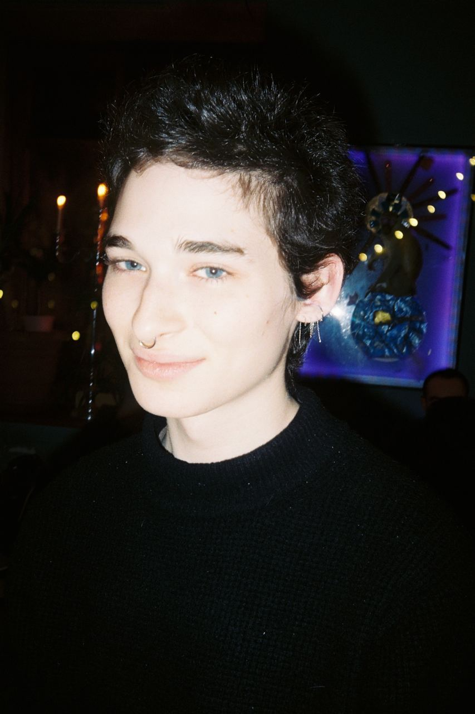

---
hide:
  - toc
  - navigation
---

# About Me

I am an independent technology consultant specialized in NLP/GenAI systems architecture for MSP & enterprise solutions clients. Previously, I was Head of AI at Seek AI, researching semantic parsing & information retrieval systems for enterprise Text-to-SQL products.

Before I was unceremoniously dumped into the world of GenAI, I earned my MS in Computational Linguistics at Montclair State University in 2023, where I worked on research in lexical semantic change detection at the Montclair NLP Lab. In 2021, I graduated from the Great Books Program at St. John's College with a BA in Liberal Arts.

Although I'm mostly corporate these days, I am still active in research! My research interests lie mainly in computational pragmatics, semantic parsing, and evaluation, and aim to answer the following questions:

- How do context and ambiguity impact the performance of semantic parsing systems?

- What kinds of metrics can be defined that are sensitive to such context-poor environments?

- How can external context (or lack thereof) be modeled in LLMs?

Check out my [CV](cv.md) page if you'd like to learn more about my recent work :)

Outside of NLP, I enjoy cooking, travel, and people with caustic senses of humor. My humble brag is that I'm verified at Bassiani, and my favorite subway line is the Q. When I was still literate, my favorite authors were Evelyn Waugh, Mikhail Bulgakov, and Giuseppe di Lampedusa. 

I am accepting new engagements and would love to hear more about your AI/ML needs! Feel free to contact me at raz [at] besaleli [dot] io if you have any potential collaborations or would just like to chat!
